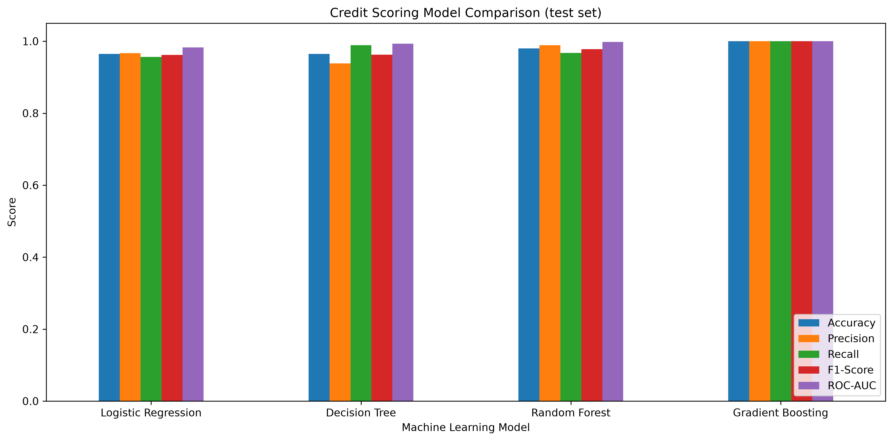
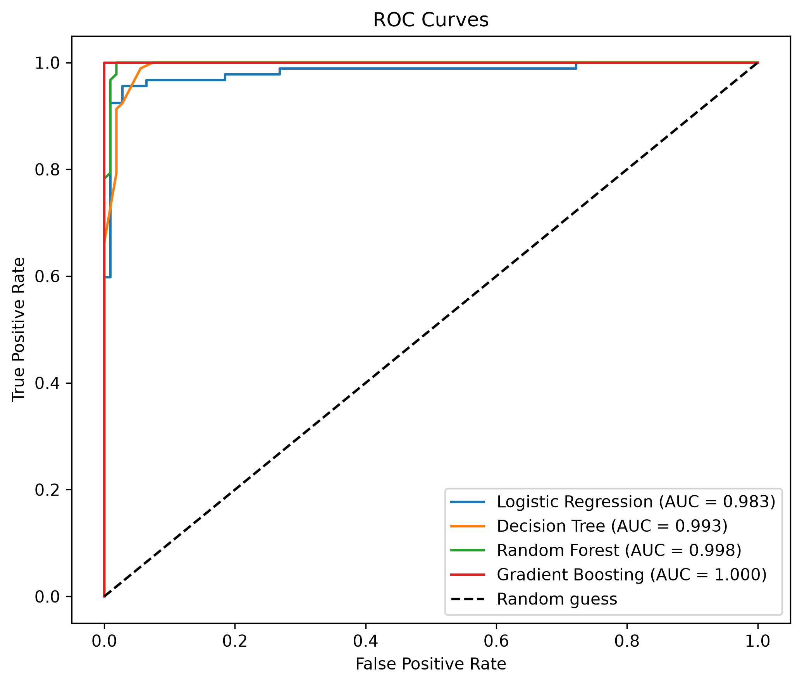
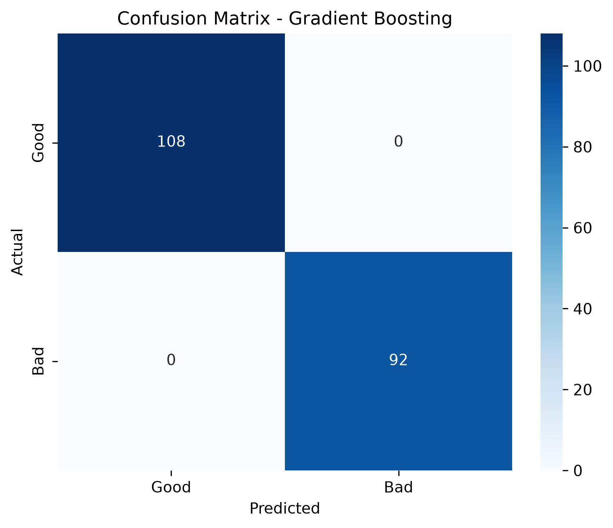
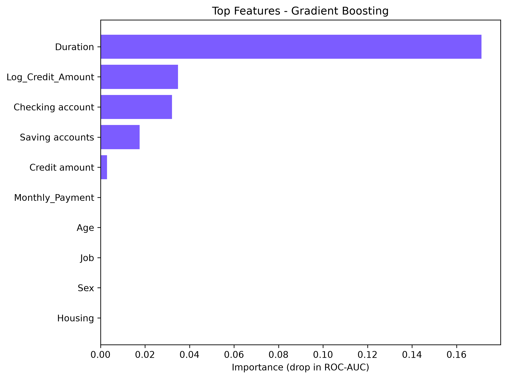

# 💳 Credit Scoring Model


Predicting an individual's **creditworthiness** (good or bad credit risk) from their financial profile, built as **Task 1** of the **CodeAlpha Machine Learning internship**.

## 🎯 Objective

Use classification algorithms to decide whether a loan applicant is a **good** or **bad** credit risk, and evaluate the models with Precision, Recall, F1-Score and ROC-AUC.

## 📂 Dataset

- **1,000 applicants**, 9 input features: age, sex, job level, housing, saving account, checking account, credit amount, loan duration and loan purpose
- **Target (`Risk`):** 538 good, 462 bad
- Missing values: `Saving accounts` (183) and `Checking account` (394)

## 🛠️ Approach

1. **Cleaning:** blank savings or checking accounts are kept as their own `unknown` category instead of being filled with the most common value
2. **Feature engineering:** `Monthly_Payment`, `Log_Credit_Amount`, `Long_Term_Loan` (24 months or more) and `Age_Group`
3. **Preprocessing pipeline:** scaling for numeric columns and one-hot encoding for categorical columns, inside a scikit-learn `Pipeline` so the test data never leaks into training
4. **Models:** Logistic Regression, Decision Tree, Random Forest and Gradient Boosting, with class balancing where supported
5. **Tuning:** 5-fold stratified cross-validation with `GridSearchCV` on the training set (80%)
6. **Selection and evaluation:** the best model is chosen by cross-validated ROC-AUC on the training data only, then evaluated once on the untouched 20% test set
7. **Explainability:** permutation feature importance shows what drives the decision

## 📊 Results

| Model | CV ROC-AUC | Accuracy | Precision | Recall | F1-Score | ROC-AUC |
|---|---|---|---|---|---|---|
| Logistic Regression | 0.9780 | 0.9650 | 0.9670 | 0.9565 | 0.9617 | 0.9826 |
| Decision Tree | 0.9833 | 0.9650 | 0.9381 | 0.9891 | 0.9630 | 0.9929 |
| Random Forest | 0.9948 | 0.9800 | 0.9889 | 0.9674 | 0.9780 | 0.9978 |
| Gradient Boosting | 0.9986 | 1.0000 | 1.0000 | 1.0000 | 1.0000 | 1.0000 |

*Test-set scores (200 applicants). CV ROC-AUC comes from 5-fold cross-validation on the training set.*

**Best model: Gradient Boosting**, selected by cross-validated ROC-AUC. Confusion matrix on the test set: 108 good and 92 bad applicants all classified correctly.

<p align="center">
  
  
</p>
<p align="center">
  
  
</p>

### 🔍 What drives the decision

- **Loan duration** is by far the most important feature, followed by the credit amount, checking account status and saving account status
- Age, sex, job level and housing had almost no influence on this dataset
- Longer loans are much riskier here: about 8% bad risk for loans up to 12 months, versus about 98% for loans longer than 36 months

### ⚠️ A note on these scores

The scores are very high because the `Risk` label in this dataset separates unusually cleanly: a single decision tree using only duration and credit amount already reaches about 86% cross-validated accuracy, and the bad-risk rate jumps sharply around 18 to 24 months of duration and a credit amount of about 2,300. With only 200 test rows, treat these numbers as results **on this dataset**, not as the performance expected from a real bank's credit data.

## 🧪 Try it: scoring sample applicants

The script also turns the predicted default probability into an illustrative **300 to 850 credit score** (lower risk gives a higher score). These three profiles are made-up examples:

| Age | Sex | Credit amount | Duration | Default probability | Credit score | Decision |
|---|---|---|---|---|---|---|
| 45 | male | 1500 | 10 months | 0.000 | 850 | Low risk |
| 35 | female | 4000 | 24 months | 0.994 | 303 | High risk |
| 23 | male | 9000 | 48 months | 1.000 | 300 | High risk |

## 🚀 How to run

```bash
# 1. Clone the repository
git clone https://github.com/Prathmesh2007-16/CodeAlpha_Credit_Scoring_Model.git
cd CodeAlpha_Credit_Scoring_Model

# 2. Install dependencies
pip install -r requirements.txt

# 3. Run the project (takes about a minute)
python credit_scoring.py
```

All charts and tables are saved in the `results/` folder, and the trained model is saved as `credit_model.joblib`.

## 🗂️ Project structure

```
CodeAlpha_Credit_Scoring_Model/
├── credit_scoring.py        # full pipeline: cleaning, features, training, evaluation
├── dataset/
│   └── german_credit_data_with_risk.csv
├── results/
│   ├── model_comparison.csv / .png
│   ├── confusion_matrix.png
│   ├── roc_curves.png
│   ├── feature_importance.png
│   ├── sample_predictions.csv
│   └── console_output.txt
├── requirements.txt
└── README.md
```

## 👨‍💻 Author

**Prathmesh Chaure**, 3rd-year Electronics (VLSI Design & Technology) student exploring VLSI, embedded systems and machine learning.

[](https://portfolio-five-lemon-47.vercel.app/)
[](https://www.linkedin.com/in/prathmesh-chaure-b38612335)
[](https://github.com/Prathmesh2007-16)

*Built during the CodeAlpha Machine Learning internship.*